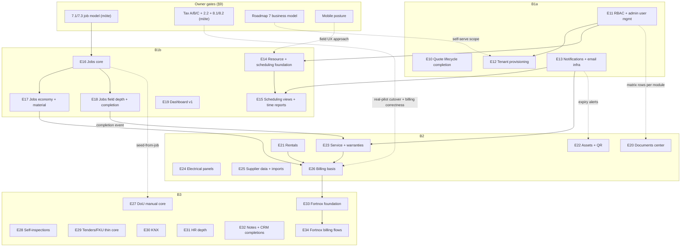

# Phase B Party-Mode Session — Ratified Direction

This document records the team ratification of Phase B shaping per the agenda in
`docs/planning/post-phase-a-plan-2026-07-08.md` Appendix A. **§4 owner direction was
treated as fixed and is not re-litigated here.** The §5 proposal was challenged item
by item; amendments are recorded as decisions PB-D1…PB-D14 (§3). The PRD was
deliberately NOT started in this session.

---

## 1. Fixed context (owner, 2026-07-08 — restated, not debated)

- Phase B = **feature parity with the legacy Lovable app** ("everything it did, but
  better") on the Phase A architecture (tenant isolation + RLS, integer-öre money,
  immutable snapshots, server-side audited commands, golden/regression discipline).
- Headline emphasis: **Jobs & Projects depth** and **Time planning & scheduling**.
- Modules built **inter-connected**, not siloed (jobs ↔ scheduling ↔ people ↔
  materials ↔ economy ↔ documents).
- **Fortnox integration is IN** (billing basis precedes it).
- Product stays **deliverable to many independent companies** (multi-tenant SaaS);
  Phase B covers tenant provisioning/onboarding and full RBAC.
- **Phase C (excluded from B):** all AI flows, bookkeeping integrations beyond
  Fortnox, live supplier APIs, customer portal, net-new features, full-release
  legal/GDPR program.

## 2. Ratified wave structure

**One Phase B** (one PRD + one architecture extension + one epics doc), internally
sequenced into waves. The §5.1 three-wave proposal is ratified **with two
amendments** (PB-D1): B1 is split into an explicit foundation stage and an
operational stage (it was Phase-A-sized on its own), and **billing basis moves from
B3 to the end of B2** so invoicing value lands earlier and Fortnox (B3) integrates
something already proven.

### Wave B1a — Access & platform foundations
- Quote lifecycle completion: Förlorad/Avböjd status + follow-up workflow
  (deliberately small first epic; pipeline warm-up; answers §8.6 — no pre-B interstitial).
- Full RBAC **mechanism** + roles + admin user management (invite/reset/remove) +
  role management UX (ADR-B001; matrix fills per module, see §5).
- Tenant provisioning & onboarding (admin/operator-driven; **self-serve signup
  deferred pending owner business-model decision** — N-2).
- Notifications + email infrastructure: bell UI, reminders, email queue,
  delivery log, suppression/unsubscribe; first sanctioned background-execution
  path (ADR-B002 — the legacy forged-JWT cron P0 must not be reproduced).

### Wave B1b — Operational core (the emphasis)
- Resource & scheduling foundation: person/resource model (user + work role +
  work hours + capacity basics — **not** an HR module, see PB-D13), bookings +
  conflict detection.
- Scheduling views & time reporting: schedule/resource/team/capacity/personal
  views, recurring bookings, conflict resolver, time reports, calendar feeds
  (public token surface → ADR-B004).
- Jobs & Projects core (gated on owner `7.1`/`7.3` — options prepared in §9.2):
  my-jobs, job members/roles incl. per-job Arbetsledare, work orders,
  order→projekt upgrade.
- Jobs economy & material: material usage/requests, payment plan, economy
  rollup, budget-vs-actual.
- Jobs field depth: diary, deviations, photos, chat, risks, reports/exports,
  completion event (seam that later seeds warranties and DoU).
- Operational dashboard v1 (B1 data sources only; widgets grow per wave — PB-D7).

### Wave B2 — Asset & service operations
- Global documents center + cross-module file index (aggregates the entity-scoped
  `file_links` model Phase A established; B1 modules emit compatible metadata — PB-D6).
- Rentals (register, quick rental, orders, delivery notes, returns, history,
  rental billing records).
- Assets (+public QR route — public surface per ADR-B004; assignments, events,
  fault reports, mileage, labels).
- Service & warranties (records, plans, agreements, due/overdue scanning →
  suggestions via the B1a notification infra; warranties hang off job completion).
- Electrical panels (manual core per §5.3).
- Supplier master data + price-list **file** imports (deterministic; live vendor
  APIs stay Phase C) + supplier article references on calc rows.
- **Billing basis (faktureringsunderlag)** across jobs/rentals/service — moved
  from B3 (PB-D11). Owner: "behövs".

### Wave B3 — Content, compliance & money-out
- DoU manual core (templates, folder/document structure, upload, versioning,
  lock, package export, material-list sync, seed-from-job).
- Self-inspections manual core (templates, sections, items, measurements,
  attachments, manual creation, export).
- Tenders/FKU **thin** manual core (upload/unzip, storage, manual summary,
  manual conversion links — flagged to owner as the thinnest parity slice, N-7).
- KNX manual tables (group-address projects, rooms/functions).
- HR & personnel depth (profiles, competence cards, certifications, training
  plans, employee documents, incidents, my-page, GDPR deletion-request workflow
  — legal touchpoint N-10; extends the B1 resource model, no parallel table).
- Notes/notice board + CRM & calc completions (customer 360, favorites,
  classification tools, duplicate-calculation flow).
- **Fortnox** foundation (OAuth/tenant connection, mapping/outbox architecture per
  ADR-B005, informed by a spike during B2) then Fortnox billing flows
  (customers/articles/invoice-basis export, status/error/retry UX).

## 3. Decisions (citable)

| ID | Decision | Key rationale |
| --- | --- | --- |
| PB-D1 | One Phase B, waves **B1a / B1b / B2 / B3** (amends §5.1: B1 split; billing basis → B2) | B1 as proposed ≈ 10 epics ≈ all of Phase A; foundations need a checkpoint before the jobs/scheduling epics consume them |
| PB-D2 | RBAC + non-admin field-worker access front-loads B1a — **ratified**; mechanism-first, permission matrix filled incrementally per module activation; server-enforced + RLS-tested | "My jobs"/bookings/time reporting are meaningless under `tenant_admin`-only; Phase A architecture §21 explicitly left this seam; full-matrix-up-front would spec permissions for modules that don't exist yet |
| PB-D3 | Quote lifecycle completion ships as **Epic 10 inside B1a**, not a pre-B interstitial (answers §8.6) | Phase A governance is closed; an interstitial would need Phase B governance anyway; small first epic re-validates the pipeline |
| PB-D4 | §5.3 manual-vs-AI split **ratified for all six modules**; tenders/FKU noted as the thinnest manual core (owner visibility, N-7) | Every other manual core is independently valuable (DoU/egenkontroller/panels are real deliverables made manually today; supplier file import was ALL the legacy had — full parity) |
| PB-D5 | Notifications/email infra is a **B1a foundation** with ADR-B002 (background-job authentication done right) | Prerequisite for scheduling reminders (B1b), service scanning (B2), expiry alerts (B2/B3); the legacy audit's P0 was exactly this surface (forged-JWT cron auth) |
| PB-D6 | Documents center **stays B2**; B1 modules must emit entity-scoped `files`/`file_links` metadata compatible with the future index | Phase A's entity-scoped model held; the global center is an aggregation layer, not a prerequisite; needed by the time asset/DoU document volume arrives |
| PB-D7 | **One operational dashboard**, v1 in B1b limited to B1 data, widget surface grows per wave; per-module analytics lives inside modules or later (answers §8.3) | Avoids a dashboard epic blocked on data that doesn't exist yet |
| PB-D8 | Guardrail re-scoping via a **single machine-readable scope manifest** + per-epic same-PR activation (§5; ADR-B003) | ~15-25 re-scoping events ahead; the Epic-9 retro flagged authored-copy drift 4× in one epic; a multi-file scavenger hunt per epic would compound it |
| PB-D9 | Document plan ratified as §7 table (supersede-vs-update per artifact, order fixed; Phase A artifacts frozen as the pilot record) | — |
| PB-D10 | Honest epic count: **21-25 candidate epics** (§6), above §5.1's "15-20+"; wave boundaries are formal re-scope checkpoints (mini-retro + next-wave re-validation) | Stating 2.5× Phase A now beats discovering it at B2 |
| PB-D11 | Billing basis in **B2-close**; Fortnox **spike** during B2; Fortnox build in B3 | Billing basis is independently valuable ("behövs"), needs job/rental/service economy (B1/B2); leaving all Fortnox discovery to B3 maximizes late-surprise risk — the spike de-risks without building |
| PB-D12 | Scheduling may land **before/parallel to** jobs depth: bookings bind (optionally) to Phase A basic jobs; jobs epics then deepen them | Independent-creatable + connectable rule (owner 2026-07-14) removes the artificial jobs→scheduling ordering |
| PB-D13 | **Resource-model split:** B1 defines the minimal bookable person (user + work role + hours + capacity); B3 HR extends the SAME records with employment depth — no parallel employee table | Direct application of "inter-connected, not siloed" to the schema |
| PB-D14 | All public token surfaces (calendar feeds, asset QR, email unsubscribe) require **ADR-B004 before the first one ships** (B1b) | These are Phase B's first unauthenticated surfaces; legacy audit flagged abuse risk on its public endpoints; NFR5's "none exist" posture is being deliberately, narrowly amended |

## 4. Dependency map

Prose facts the map encodes (from §5.2 of the plan, confirmed):
- RBAC mechanism (E11) precedes everything B1b and contributes matrix rows to every
  later module activation.
- Notification/email infra (E13) precedes scheduling reminders, service scanning,
  and expiry alerts.
- Job model `7.1`/`7.3` (owner) gates E16-E18 **design**, not B1a and not scheduling
  foundation — bookings can bind to Phase A basic jobs meanwhile (PB-D12).
- Billing basis (E26) needs job economy (E17) and consumes rentals/service billing
  records; Fortnox (E33/E34) needs billing basis.
- Warranty creation hangs off the job completion event (E18→E23); DoU seeds hang
  off jobs (E16→E27).
- Tax blocks A/B/C remain the real-pilot cutover gate (unchanged by Phase B) and
  additionally bound billing-basis correctness sign-off.

## 5. Guardrail re-scoping mechanism (agreed; answers agenda item 5)

Phase A scope is enforced in code (`src/features/files/deferred-categories.ts`
deny-list, nav guardrails from Story 1.3, 24-tenant-table and 7-nav-item validator
pins in `tests/unit/docs/**`, deferred-token scans, `AGENTS.md`, the
`phase-scope-reviewer` agent). Phase B will re-scope this surface ~15-25 times.
Mechanism (PB-D8, to be formalized as ADR-B003):

1. **One-time Phase B re-baseline** (lands with PRD ratification, before the first
   B story): rewrite `AGENTS.md` phase statement + deferral list; update
   `phase-scope-reviewer` and `docs/process` scope statements; introduce a single
   machine-readable **scope manifest** (e.g. `docs/scope/phase-b-scope.<yaml|ts>`)
   listing modules (active/pending + authorizing epic), approved nav items, and
   tenant tables. The deny-list, nav guardrails, table-count validators, and
   scope scans are refactored to **derive their expected values from the manifest**
   instead of hardcoding them. Phase A's surface is the initial `active` set.
2. **Per-epic activation:** the first story of a module epic flips that module
   `pending → active` in the manifest (with epic reference + date) **in the same PR**
   as the module's first schema/nav change. Guardrail tests recompute from the
   manifest; the corresponding deny-list category is removed in the same change.
   Fail-loud is retained: any surface not manifest-listed still fails CI.
3. **The manifest gets its own validator:** an `active` entry without an epic
   reference fails; a nav item or tenant table not traceable to an active module
   fails. (Presence AND coherence — the Epic-9 `A22` lesson.)
4. `phase-scope-reviewer` reviews diffs against the manifest, not a static list.

This also collapses the Epic-9 retro's "authored-copy drift" theme (four
independent copies of scope truth) into one source, and connects to W1 cleanup.

## 6. Epic candidate list + capacity sanity (agenda item 8)

Candidates E10-E34 as listed in §2/§4 — **25 candidates; plausible merges
(provisioning→RBAC, panels→assets, KNX→tenders-adjacent, notes+CRM bundle) give a
floor of ~21**. This is ~2.5× Phase A's 9 epics, above §5.1's "15-20+" — stated
honestly now rather than discovered at B2 (PB-D10).

Capacity reference: Phase A delivered 9 epics in ~4.5 weeks of pipeline operation
(2026-06-09 architecture → 2026-07-08 epic-9 merge) via the established
per-epic auto-bmad pipeline. Linear extrapolation puts Phase B at **roughly 11-13
pipeline-weeks**, i.e. an October-2026-ish horizon — with two stated caveats:
(1) E14-E18 (scheduling + jobs) are the least-certain sizings and sit gated on
`7.1`/`7.3`; (2) owner-gate latency, not engineering throughput, was Phase A's
long pole and is again on the critical path (§9). Wave boundaries B1a→B1b→B2→B3
are formal re-scope checkpoints: mini-retro plus re-validation of the next wave's
content before it starts. Epic numbering continues at 10; delivery continues via
the established pipeline. Near-term workstreams W1 (cleanup) and W2 (UAT dry-run)
run independently and are unaffected.

## 7. Document plan (agenda item 6; ratified order)

| # | Artifact | Action | When |
| --- | --- | --- | --- |
| 1 | This session record | **Done** (this file) | Now |
| 2 | `owner-signoff-questions.md` | **Update** (living register): append the Phase B section from §9 | With/before brief |
| 3 | Product brief | **New** Phase B brief (no Phase A brief exists — PRD frontmatter records `productBriefs: 0`) | Next session (`/bmad-product-brief`) |
| 4 | PRD | **Supersede**: new Phase B PRD file; Phase A `prd.md` frozen immutable as the pilot record | After brief (`/bmad-prd`) |
| 5 | UX design spec | **New** Phase B spec (field-worker surfaces, scheduling views, job workspace are net-new); references the Phase A spec for carried surfaces | After/with PRD |
| 6 | Architecture | **Extend-by-supersession**: new Phase B architecture doc carrying ADR-A001…A009 forward unchanged and adding the ADR-B series; Phase A doc frozen | After PRD/UX |
| 7 | ADRs | ADR-B001 RBAC/non-admin reversal (with PRD ratification); ADR-B002 background jobs/notifications/email; ADR-B003 scope manifest; ADR-B004 public token surfaces (before B1b); ADR-B005 Fortnox layer (before B3, after the B2 spike); ADR-B006 job model (after möte item C) | As listed |
| 8 | `AGENTS.md` + `docs/process` + guardrail re-baseline (§5 step 1) | **Rewrite** phase statement + deferral list, one change, ADR-backed | With PRD ratification, before first B story |
| 9 | Epics | **New** Phase B epics doc (Epic 10+, wave-tagged); Phase A `epics.md` frozen | After architecture |
| 10 | `project-context.md` | **Refresh** | After architecture, before first B story |
| 11 | `saas-rebuild-phased-plan-2026-06-07.md` | **Append** Phase B/C section (do not supersede) | With PRD |

File-layout rule: Phase A planning artifacts are **not modified** (they are the
pilot record). Phase B siblings use a `-phase-b` suffix or a `phase-b/` subfolder —
exact layout decided when the brief is created, against BMAD tooling conventions.

## 8. Manual-vs-AI split confirmation (agenda item 3)

§5.3 ratified per module (PB-D4). Independent-value verdicts:

| Module | Phase B manual core independently valuable? | Note |
| --- | --- | --- |
| DoU | **Yes** — DoU packages are contractual deliverables assembled manually today; digitized assembly/versioning/export is standalone value | AI classification/generation stays C |
| Self-inspections | **Yes** — egenkontroller are compliance obligations; template-driven manual creation is the normal workflow | AI generation stays C |
| Tenders/FKU | **Marginal** — organized storage + manual summary + manual conversion links only; the legacy value was mostly the AI analysis | Conscious thin slice; owner visibility item N-7; full value arrives in C |
| Electrical panels | **Yes** — gruppförteckningar/circuit schedules are real manual deliverables | AI image import stays C |
| KNX | **Yes** (niche, small) — manual group-address tables | AI ETS parsing stays C |
| Supplier data | **Yes — full parity** — legacy had file import only, so the manual core IS the whole legacy module | Live vendor APIs stay C |

## 9. Consolidated owner-decision list (agenda item 7)

System of record stays `owner-signoff-questions.md`; this section is the Phase B
delta to append there. **The Phase A möte items are still open and now ALSO gate
B1 design** — one working session can clear both sets.

### 9.1 Carried from Phase A (möte-open; unchanged IDs)

| ID | Item | Now gates |
| --- | --- | --- |
| A.1/A.2, B.1-B.4, C.1-C.3 | Rounding, VAT rate, ROT and grön teknik rates/caps/schablon/underlag | Real-pilot cutover (unchanged) **+ billing-basis correctness (E26)** |
| 2.2 | Hidden-row mechanics in totals/deductions | Real-pilot cutover; calc engine behavior |
| 7.1 / 7.3 | Job model structure + first job-card fields | **E16-E18 design (B1b critical path)** + pilot sign-off |
| 8.1 / 8.2 | Migration classification round 1 + golden examples | Real-pilot cutover |

### 9.2 Job-model options prepared for the möte (per plan §8.7 — present, don't answer)

- **Option A — legacy-shaped (team default recommendation):** `Jobb` is the
  container; contains arbetsorder (work orders); an upgrade path marks a jobb as
  projekt, unlocking project features (members/roles, payment plan, deeper
  economy). Matches the oracle; parity-safe.
- **Option B — flat + grouping:** `Jobb` and `Projekt` are separate entities;
  a projekt groups jobb. Cleaner conceptual split; diverges from legacy UX and
  migration shape.
- **Option C — single typed entity (team's implementation preference under A):**
  one `jobs` table, `type ∈ {order, projekt}`, arbetsorder as child work items,
  "upgrade" = audited type change. Phase A's `jobs` is already nearly this.
- Team recommendation: **present A, implemented as C** (B kept as the challenger).
- `7.3` field proposal to prune with the owner: title, type, status, customer,
  anläggning + specific kontakt (required per owner answer `1.5`), project
  manager/Arbetsledare, planned start/end, budget from accepted quote, description.

### 9.3 New for Phase B

| ID | Question | Gates | Team input |
| --- | --- | --- | --- |
| N-1 | Migration classification **round 2**: live/archive/excluded per B module (rentals, assets, service, DoU, self-inspections, tenders, HR, time data) — round 1 covered only Phase A tables | Each B2/B3 module's migration story | Reuse the 9.1 classification framework |
| N-2 | Business model / per-company pricing / provisioning flow (Roadmap 7, "gemensamt beslut efter möte") | Self-serve signup scope in E12 (admin-driven provisioning proceeds regardless) | Decouple: don't block B1a on this |
| N-3 | Mobile posture for field workers in B1 (Roadmap 2/8, with Alex) | E14/E15/E16 field UX approach | Team recommends **responsive web first**, native app as a Phase C option; legacy was web |
| N-4 | Confirm role set as RBAC seed: Admin, Projektledare, Montör, Säljare, Ekonomi + per-job Arbetsledare (owner's own Roadmap 1 answer) — incl. sensitive-field visibility (may Montör see prices? Säljare see margins?) | E11 matrix seed | Present the Roadmap-1 list back for confirmation, with a per-role money-visibility question |
| N-5 | Fortnox prerequisites: which Fortnox account/licenses, API access, first flows (customers? articles? invoice basis?), and the **content definition of a faktureringsunderlag** (time, material, fixed-price/payment-plan items?) | E26 shape; E33/E34 | Spike during B2 informs this |
| N-6 | Email sending activation: sending domain, from-address, which flows email first (quote send? follow-up reminders? notification digests?) | E13 | Owner asked for email-from-app (`3.4`); Phase B activates the seam |
| N-7 | Accept the tenders/FKU **thin** manual core as Phase B parity (full value = C) | E29 | Visibility item — team has decided the slice; owner should not be surprised |
| N-8 | Who supplies real DoU + self-inspection template content (compliance content is owner-side) | E27/E28 | Template ingestion can be built before content arrives |
| N-9 | Scheduling inputs: work-hours model (anställningsgrad?), capacity rules, public-holiday handling | E14 | Minimal set needed for conflict/capacity logic |
| N-10 | GDPR/retention posture for the HR deletion-request workflow (feature is B3; the full legal program remains C) | E31 | Legal touchpoint, not a full program |

## 10. Explicitly out (Phase C guard — restated)

All AI flows (§5.3 right column), bookkeeping integrations beyond Fortnox, live
supplier vendor APIs (Ahlsell/Rexel/Solar/Sonepar), customer portal / online
acceptance (BankID/portal signing), net-new features, and the full-release
legal/GDPR items parked in Phase A (disclaimer wording `A22-tax`, retention,
authoritative tax-number ownership NFR15). Nothing in this session pulls any of
these forward.

## 11. Next steps (per plan §9, confirmed)

1. Append §9 to `owner-signoff-questions.md`; send/schedule the owner working
   session (carried möte items + N-list — one agenda).
2. `/bmad-product-brief` (create, Phase B) → `/bmad-prd` (create, Phase B) →
   validate — **against this document**.
3. Phase B UX design for the new surfaces (field-worker, scheduling, job workspace).
4. Phase B architecture extension + ADR-B001…B006 as sequenced in §7.
5. `AGENTS.md`/guardrail re-baseline (§5 step 1) with PRD ratification.
6. `/bmad-create-epics-and-stories` (Epic 10+, wave-tagged) → sprint planning →
   `/auto-bmad epic --epic 10`.
7. In parallel, anytime: W1 cleanup PR, W2 UAT dry-run, owner answers as they arrive.
