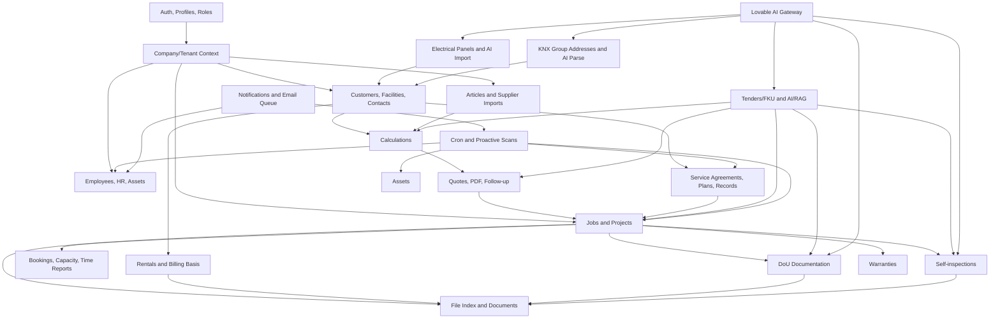

# ElPro Initial System Audit

Date: 2026-06-01  
Repository: `C:\Elpro`  
Method: static code/schema review plus best-effort local install, test, lint, build, and dependency audit. This is not yet a full live UX review, penetration test, or production-readiness assessment.

## Executive Summary

The product already covers a large part of an electrician company's operational workflow: customers, calculations, quotes, jobs, service, rentals, assets, electrical panels, self-inspections, DoU documentation, tenders/FKU, HR, time planning, notifications, document handling, and several AI-assisted document parsing flows. The domain coverage is unusually broad for a Lovable/vibe-coded prototype and there is real business insight in the feature set.

The system is not ready to license to other companies as-is. The strongest blockers are engineering governance and security: no meaningful tests, no clean reproducible install with `npm ci`, no git/CI setup in the downloaded project, 1426 lint issues, a large amount of weak typing, production dependency vulnerabilities, and at least one serious authorization issue in cron/service edge functions.

The current architecture is a React/Vite frontend backed by Supabase Postgres, Supabase Auth, Supabase Storage, Row Level Security, and many Supabase Edge Functions. This can be a reasonable prototype stack, but it needs a hardening phase before it becomes a multi-tenant SaaS product.

## Verified Technology Stack

| Area | Current implementation |
| --- | --- |
| Frontend | React 18, Vite, TypeScript, Tailwind, shadcn/Radix UI, lucide icons |
| State/data access | Supabase JS client, React Query in parts of the app |
| Backend | Supabase Auth, Postgres, Storage, Edge Functions |
| Database control | SQL migrations in `supabase/migrations` |
| AI/document processing | Supabase Edge Functions calling Lovable AI Gateway |
| Documents/PDF/Excel | `pdf-lib`, `pdfmake`, `jspdf`, `pdfjs-dist`, `xlsx`, `jszip` |
| Tests | Vitest configured, but only one placeholder test exists |
| Package managers | `package-lock.json` and `bun.lockb` both present; local Bun is not installed |

## Current Feature Inventory

### Authentication, Tenancy, and Roles

- Login and registration flow.
- Company registration through a `register_company` RPC.
- Company-scoped profile context with `company_id`.
- User roles: `admin`, `projektledare`, `installator`, `ekonomi`.
- Admin user management through Edge Functions: invite user, reset password, set password, remove user.
- Some route/sidebar gating exists in the client.
- Database RLS is enabled across the table set, with many tenant-aware policies.

### Dashboard

- Operational KPI dashboard.
- Tracks active calculations, sent quotes, quote follow-up metrics, hit rate, rentals, service, warranties, open tickets, DoU work, employee compliance items, incidents, suggestions, and similar operational data.
- Action cards for follow-ups, bookings, service, warranties, and activity.

### Customers and CRM

- Customer list and customer detail pages.
- Supports customer types such as private persons, companies, housing associations, foundations, and public-sector style customers.
- Facilities connected to customers.
- Customer contacts.
- Favorite customers.
- Customer 360-style overview across calculations, quotes, rentals, and self-inspections.
- Sensitive personnummer handling for ROT-related flows, with encrypted storage through Edge Function/RPC.

### Calculations

- Calculation list and detail pages.
- Calculation sections and rows.
- Rows can represent material, labor, subcontractor, and other cost types.
- Work roles and hourly prices.
- Own article register and supplier article references.
- Tax deduction handling, including ROT/green-tech style validation.
- Calculation options/tillval.
- Quote display modes, notes, and attachments.
- Duplicate calculation flow.

### Quotes

- Quote list and detail pages.
- Quote creation from calculation data.
- Quote preview and PDF/document generation.
- Quote attachments and terms templates.
- Quote versions/statuses.
- Quote follow-up handling.
- Accept/reject/lost-reason style lifecycle.
- Quote acceptance can feed into job creation flows.

### Jobs and Projects

- Job list, "my jobs", and job detail pages.
- Regular order/project workflows, including upgrade from order to project.
- Job members with operational roles such as project lead, installer, finance, subcontractor-like roles.
- Job tabs/features include overview, work orders, self-inspections, schedule, material, economy, diary, deviations, photos, chat, risks, reports, and analytics.
- Job material usage and material requests.
- Job payment plan and economy rollup.
- Job diary entries, deviations, photos, chat attachments, risks, and report/export functions.
- Job completion can create warranty records.
- Jobs can seed DoU documentation packages.

### Time Planning and Scheduling

- Time planning page with schedule, resource/team views, timelines, capacity, personal view, reports, and settings.
- Bookings with assignee, work role, job/customer/facility/contact context.
- Recurring bookings.
- Booking conflict checks and resolver UI.
- User work hours.
- Time reports.
- Calendar feed token infrastructure.

### Rentals

- Rental item register.
- Quick rental flow.
- Rental orders and grouped orders.
- Delivery note flow.
- Return item/order flows.
- Rental history.
- Billing basis/invoice-underlag style support.
- Rental billing records.
- Duplicate rental item flow.

### Assets

- Asset register for vehicles/tools/equipment.
- Create, edit, and archive assets.
- Asset detail page.
- Public QR route for asset lookup/reporting.
- Asset assignments to employees.
- Asset events such as service, inspection, insurance, and related events.
- Asset documents.
- Fault reports.
- Mileage logs.
- QR/label PDF generation.
- Proactive asset scan/notification infrastructure.

### Electrical Panels

- Electrical panel list and detail pages.
- Panel groups/circuit schedule.
- RCD information and panel metadata.
- Bulk edit and duplicate flows.
- Print/PDF export.
- AI image import through `analyze-panel-schedule`.

### Articles and Supplier Data

- Own article register.
- Supplier master data.
- Supplier price lists.
- Supplier articles.
- Supplier discount agreements.
- Supplier file import/parsing.
- No live supplier vendor API integration was found in the current codebase.

### Service

- Service records.
- Service plans.
- Service agreements.
- Due/overdue service handling.
- Service plan to job creation through database function/Edge Function paths.
- Background service scanning can create service job suggestions and potentially jobs.

### Warranties

- Warranty list/widget.
- Warranty records connected to completed jobs.
- Expiry tracking.

### Documents and File Index

- Global document management page.
- Central `file_index` abstraction aggregating files across modules.
- Preview/download through signed URLs.
- Soft delete/restore concepts.
- Manager/admin-style trash handling.

### DoU Documentation

- DoU project list/detail.
- Discipline templates and folder/document structure.
- Upload/import documents.
- Document editor, preview, render, package export, versioning, and lock/unlock concepts.
- Material list synchronization.
- Duplicate checking.
- AI-assisted document classification, material classification, supplier PDF splitting, armature list parsing, product-sheet matching, material-list generation, narrative generation, and validation.

### Self-Inspections

- Self-inspection list/detail pages.
- Templates, sections, items, assignees, measurements, and attachments.
- Manual self-inspection creation.
- AI-generated self-inspections from PDF/document inputs.
- Export function.
- Can be linked to customers, facilities, jobs, and DoU contexts.

### Tenders / FKU

- Tender list/detail pages.
- Upload tender files and ZIP bundles.
- Unzip tender bundles.
- Analyze tender files, including PDFs, Office-like files, images, OCR-like extraction, chunks, facts, and quantities.
- Tender RAG/chat flow.
- Tender summary generation.
- Convert tender output into calculations, quotes, jobs, DoU projects, self-inspections, and document exports.
- Quantity extraction exists in schema/code, but parts of the UI still show "coming" style behavior.

### KNX Tooling

- KNX group-address projects.
- AI parsing of ETS Buildings PDFs.
- Rooms/functions/group-address tables and settings.

### HR and Personnel

- Employee list and detail pages.
- Employee profiles and employment data.
- Competence cards and certifications.
- Training plans.
- Employee documents.
- Employee bookings and assigned assets.
- Incidents and GDPR/data deletion flows.
- "My page" for employee self-service.
- HR inbox for suggestions, incidents, and data deletion requests.
- Anonymous improvement suggestions.

### Notes / Notice Board

- Internal notice board.
- Note categories.
- Archive behavior.
- Mention-like notification support.

### Admin

- Company settings.
- VAT/default settings.
- Quote settings, colors, logos, and terms templates.
- User/role administration.
- Work roles and prices.
- Calculation settings.
- Data quality/admin panels.
- Notification/proactivity settings.
- Customer classification tools.
- Personnummer cleanup tooling.
- Internal product backlog.

### Notifications and Email Infrastructure

- Notifications table and UI/bell behavior.
- Job reminders.
- Upcoming booking notifications.
- Expiring document notifications.
- Service suggestions and proactive scans.
- Email queue and delivery-log infrastructure.
- Suppressed email and unsubscribe-token concepts.

## Architecture Map

## Data and Backend Surface

The database currently has 107 detected application tables, including:

- Core tenancy/auth: `companies`, `profiles`, `user_roles`, `user_invitations`.
- CRM: `customers`, `customer_contacts`, `customer_sensitive`, `facilities`.
- Calculations/quotes: `calculations`, `calculation_sections`, `calculation_rows`, `calculation_attachments`, `quotes`, `quote_attachments`, `quote_followups`, `terms_templates`.
- Jobs/projects: `jobs`, `job_members`, `job_work_orders`, `job_material_usage`, `job_material_requests`, `job_payment_plan`, `job_diary_entries`, `job_deviations`, `job_photos`, `job_chat_messages`, `job_risks`, `job_report_exports`, `job_schedule_phases`.
- Time: `bookings`, `booking_participants`, `time_reports`, `user_work_hours`, `user_calendar_tokens`, `public_holidays`.
- Rentals/assets: `rental_items`, `rental_orders`, `rentals`, `rental_billing`, `assets`, `asset_assignments`, `asset_events`, `asset_documents`, `asset_fault_reports`, `asset_mileage_log`, `asset_label_jobs`.
- Service/warranty: `service_records`, `service_plans`, `service_agreements`, `service_job_suggestions`, `warranties`.
- Documents/DoU/self-inspection: `file_index`, `dou_projects`, `dou_documents`, `dou_material_lists`, `dou_project_versions`, `self_inspections`, `self_inspection_sections`, `self_inspection_items`, `self_inspection_templates`, `self_inspection_attachments`.
- Tender/AI: `tenders`, `tender_files`, `tender_chunks`, `tender_facts`, `tender_quantities`, `tender_chat_messages`, `ai_usage_log`.
- HR: `employee_profiles`, `employee_competencies`, `employee_certifications`, `training_plans`, `employee_documents`, `incident_reports`, `improvement_suggestions`, `data_deletion_requests`.
- Supplier/articles: `articles`, `article_categories`, `suppliers`, `supplier_articles`, `supplier_price_lists`, `supplier_discount_agreements`.
- Notifications/email: `notifications`, `notification_settings`, `user_notification_prefs`, `email_send_log`, `email_send_state`, `email_unsubscribe_tokens`, `suppressed_emails`.

Detected Supabase Edge Functions include:

- AI/document processing: `analyze-armature-list`, `analyze-panel-schedule`, `analyze-tender-file`, `chat-tender`, `classify-dou-documents`, `classify-dou-materials`, `generate-dou-narrative`, `generate-material-list`, `generate-self-inspection`, `parse-knx-buildings`, `parse-supplier-file`, `split-supplier-pdf`, `summarize-tender`, `unzip-tender-bundle`, `validate-dou-project`.
- Export/rendering: `export-dou-package`, `export-employee-card`, `export-job-package`, `export-job-report`, `export-self-inspection`, `generate-armature-xlsx`, `render-dou-document`.
- Business workflows: `complete-job`, `convert-tender`, `customer-personnummer`, `execute-deletion-request`, `seed-dou-from-job`.
- Admin/background: `asset-proactive-scan`, `job-proactive-scan`, `manage-users`, `notify-expiring-documents`, `notify-upcoming-bookings`, `process-email-queue`, `process-pending-deletions`, `scan-service-plans`, `submit-anonymous-suggestion`, `calendar-feed`.

## Verification Results

| Check | Result |
| --- | --- |
| `git status` | Failed: directory is not a git repository |
| `npm ci` | Failed: `package-lock.json` is out of sync with `package.json` |
| `bun --version` | Failed: Bun is not installed locally |
| `npm install --no-package-lock --no-audit --no-fund` | Succeeded as a best-effort install without modifying lockfile |
| `npm run test` | Passed, but only one placeholder test exists |
| `npm run lint` | Failed with 1426 problems: 1319 errors and 107 warnings |
| `npm run build` | Passed, but emitted large-bundle warnings |
| `npm audit --omit=dev --json` | Reported 10 production dependency vulnerabilities in the best-effort install: 7 high, 3 moderate |

Build output warning highlights:

- Main frontend bundle around 4.27 MB minified / 1.29 MB gzip.
- `pdfmake` and font assets are large.
- Vite warns about chunks above 500 kB and mixed dynamic/static imports.

## Key Gaps and Risks

### P0 - Must Fix Before External Customer Use

#### Forged JWT / Cron Authorization Risk

Several Edge Functions are configured with `verify_jwt = false` in `supabase/config.toml`, including background/cron-style jobs. The shared cron guard decodes JWT payloads without signature verification and treats a decoded `role === "service_role"` as trusted.

Because these functions use the Supabase service role key internally, this is a serious authorization issue. A forged or unsigned bearer token could plausibly trigger privileged background jobs if the endpoint is reachable. Affected flows include proactive scans, service-plan scans, document expiry notifications, and pending deletion processing.

Required fix:

- For public cron endpoints, require only a strong `x-cron-secret` or equivalent signed secret.
- Do not trust decoded JWT payloads unless the signature is verified.
- If service-role JWT access is needed, enable platform JWT verification or verify against Supabase/JWKS correctly.
- Add negative tests proving forged tokens are rejected.

#### No Reproducible Clean Install

`npm ci` fails because `package-lock.json` and `package.json` are inconsistent. The project also contains both `package-lock.json` and `bun.lockb`, while local Bun is not installed.

Required fix:

- Pick one package manager.
- Regenerate and commit a clean lockfile.
- Make CI run `install`, `lint`, `test`, and `build` from a fresh checkout.

#### No Meaningful Test Coverage

The only detected test is a placeholder `expect(true).toBe(true)`. For a product handling money, customer records, personal data, AI-parsed documents, and multi-tenant access, this is a major blocker.

Minimum needed:

- RLS/authorization tests.
- Calculation/quote financial tests.
- Tax deduction tests.
- Customer/personnummer tests.
- Edge Function tests for auth boundaries.
- E2E tests for core workflows.
- Migration tests from an empty database.

#### Lint and Type Safety Are Not Production Grade

`npm run lint` fails with 1426 issues. There are many uses of `any`, `as any`, and `@ts-nocheck`, including in sensitive Edge Functions.

Required fix:

- Remove `@ts-nocheck` from Edge Functions first.
- Introduce typed Supabase schema generation.
- Raise strictness incrementally but deliberately.
- Keep lint green in CI.

#### RBAC Is Not Yet a Product-Grade Permission Model

Roles exist and some client routes/sidebar items are gated, but many routes are available to any authenticated user. Database RLS appears broadly present, but current role behavior needs formal verification.

Required fix:

- Define a permission matrix by role and feature.
- Enforce authorization server-side and in RLS, not only in React.
- Add automated role-based tests.
- Build field-worker mobile workflows around least privilege.

### P1 - High Priority Before SaaS Commercialization

#### No Fortnox Integration Found

No Fortnox API integration was found in the codebase. The system can produce internal billing/invoice basis data in some modules, but the intended two-system vision with Fortnox is not implemented yet.

Required follow-up:

- Define which records flow to Fortnox: customers, invoices, articles, cost centers, payments, bookkeeping vouchers, attachments.
- Decide source of truth per object.
- Design sync, reconciliation, error handling, and audit trails.

#### No Live Supplier Vendor API Integration Found

Supplier imports and price-list parsing exist, but no live integrations with supplier APIs were found.

Required follow-up:

- Identify priority suppliers.
- Confirm API availability, commercial terms, authentication, rate limits, and article/price semantics.
- Decide whether supplier data is imported batch-wise, queried live, or both.

#### Dependency Vulnerabilities

The best-effort production audit reported 10 vulnerabilities, including high-severity advisories in routing/transitive packages and common utility packages. Because `npm ci` fails, this result is not a clean locked audit, but it is enough to show dependency maintenance risk.

Required fix:

- Repair lockfile first.
- Run a clean audit.
- Upgrade vulnerable packages.
- Add dependency scanning in CI.

#### AI Governance Is Missing

The product sends tenders, images, PDFs, customer/project documents, and other business data to the Lovable AI Gateway from Edge Functions.

Required follow-up:

- Establish data processing terms and retention guarantees.
- Define what customer/employee data may be sent to AI providers.
- Add AI usage/cost limits per tenant.
- Add prompt/model/version logging.
- Add golden test datasets for AI extraction quality.
- Require human review before AI output affects contractual, financial, or compliance records.

#### Bundle Size and Mobile Performance Risk

The build passes, but the frontend bundle is large. This is a risk for field users on mobile/tablet connections.

Required fix:

- Add route-level code splitting.
- Lazy-load PDF, Excel, tender, DoU, and AI-heavy modules.
- Measure mobile performance on representative devices.

#### Migration and Schema Sprawl

The project has many migrations and a very broad schema. RLS is enabled broadly, which is good, but policy correctness cannot be proven by static grep.

Required fix:

- Create a clean baseline migration strategy.
- Run migrations from empty DB in CI.
- Add RLS tests for each role/tenant boundary.
- Generate typed database clients.
- Document data ownership per table.

### P2 - Needed for Operational Maturity

#### Missing Project Documentation

`README.md` is still the default Lovable placeholder. There is no clear setup, architecture, deployment, environment, testing, or operational documentation.

#### No CI/CD Found

No git repository or GitHub Actions setup was present in the downloaded folder. Even if the Lovable project has its own deployment path, an independent software company needs a normal source-control and release process.

#### Environment Hygiene Needs Work

`.env` is present in the project root and `.gitignore` does not ignore `.env`. The checked variables are Vite/Supabase public variables, not service-role secrets, but the pattern is still unsafe for a commercial project.

Required fix:

- Ignore `.env`.
- Commit `.env.example`.
- Manage production/staging secrets outside git.
- Document required Edge Function secrets: service role key, AI key, cron secret, personnummer encryption key, email/send URL, and similar values.

#### Observability Is Thin

The app has some internal logs such as activity, email, and AI usage logs, but no clear application monitoring, error tracking, uptime checks, alerting, or Edge Function job monitoring.

#### Anonymous Suggestion Endpoint Abuse Risk

The anonymous suggestion endpoint is intentionally public, but it appears to accept a company identifier and create suggestions without obvious captcha/rate limiting. This needs abuse protection before public exposure.

#### Public Calendar Feed Requires Review

The tokenized calendar feed pattern is reasonable, but token entropy, rotation, revocation, and UI controls should be verified.

#### Mobile/Tablet UX Has Not Been Verified

The code has responsive patterns and a mobile hook, but no automated or manual evidence yet that key field workflows are usable on mobile/tablet.

## Business-Case Interpretation

The promising part is product/domain fit. The system models many real workflows that electrician firms actually need, and it is clearly built by someone close to the work. That is hard to fake.

The weak part is software maturity. The current project looks like an ambitious internal tool that grew quickly, not yet like a licensable multi-tenant SaaS. The path forward is not "polish a few screens"; it is a structured hardening and productization program.

Most important commercial question: can the domain-specific workflow advantage justify the cost of rebuilding/hardening the foundation, especially around security, RBAC, accounting integration, supplier integrations, supportability, and compliance?

## Recommended Next Artifacts

1. SaaS readiness roadmap with phases, scope, and estimated effort.
2. Security risk register and threat model.
3. RBAC permission matrix for admin, project lead, installer, finance, and external/subcontractor roles.
4. Fortnox integration feasibility note.
5. Supplier integration feasibility note.
6. Database/entity relationship map.
7. Test strategy and minimum CI gate definition.
8. Mobile field-work UX audit.
9. Business-case model: target firms, pricing, support cost, onboarding cost, and differentiators.

## Immediate Recommended Next Steps

1. Fix the cron/service authorization issue.
2. Put the project into a real git repository and establish CI.
3. Pick npm or Bun, repair the lockfile, and make clean install reproducible.
4. Add first meaningful tests around auth/RLS and core money flows.
5. Define the RBAC permission matrix before building more field-worker features.
6. Decide whether the current Supabase/Lovable architecture is the long-term base or a prototype to migrate from.
